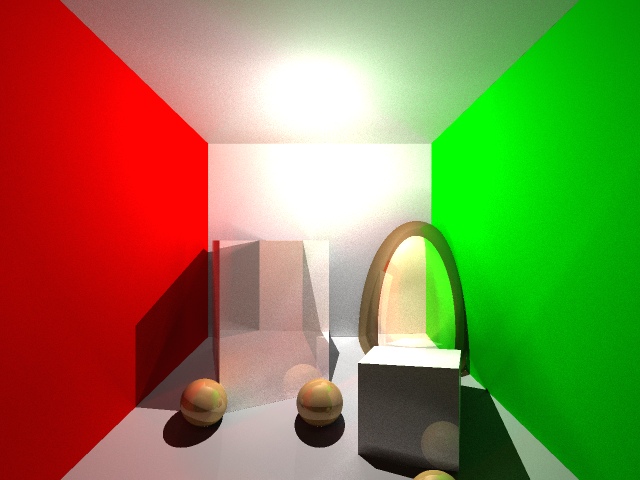

# RayTracer

Simple ray tracer for on-line course. 

The project was rapidly prototyped, and that is why has some of limitations:

Most of sources in the header files and i this it is not the problem for such small project.
The project is not optimized for perfromance or memory footprint.
The precision of renderer was specialy decreases to make this source code not workable for new students.

Features

  Raytracing with varying tracing depth
  Directional and point lights
  Antialysing
  Basic materials
  Global illumination
  Text file based to define the world

